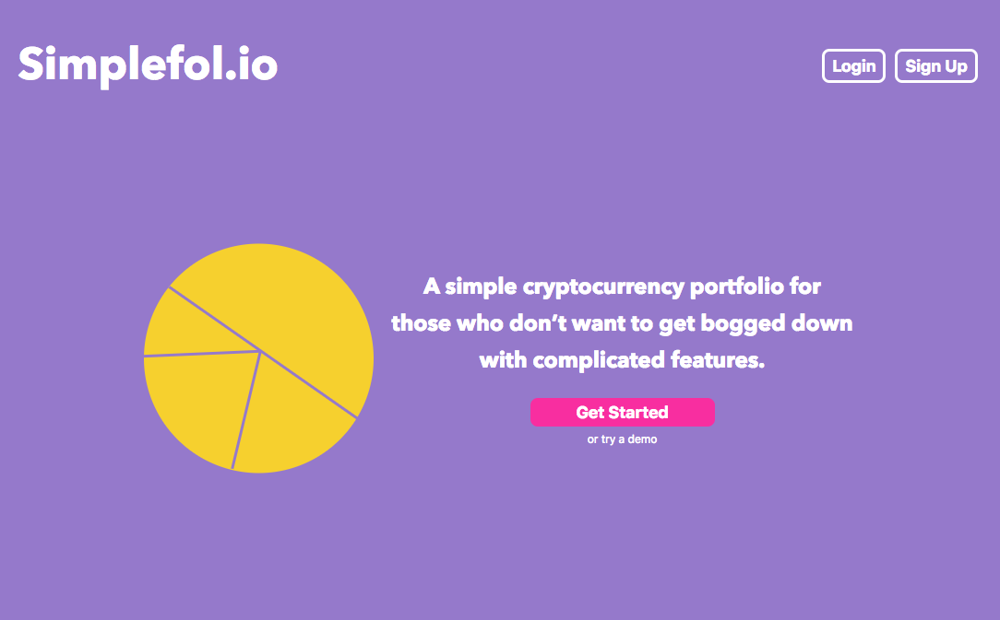
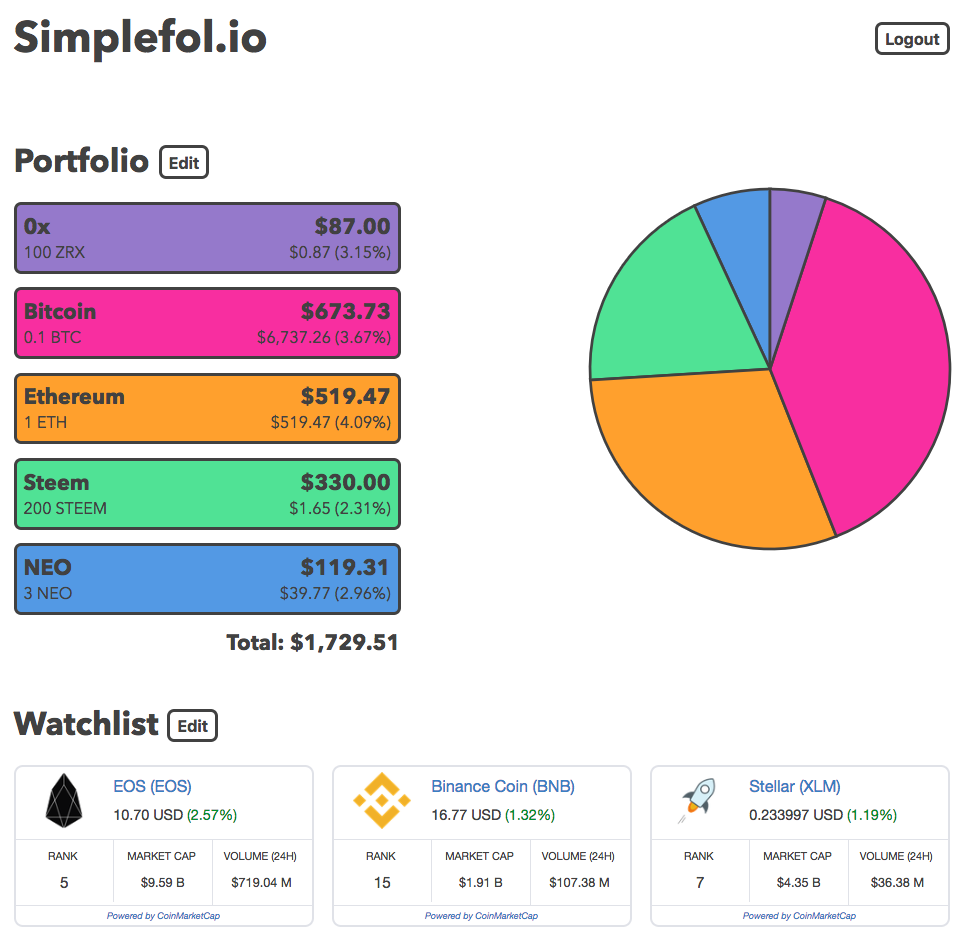

# Simplefol.io

link to live app: https://simplefol.io/

## Project Summary

This is the front end for a very simple cryptocurrency portfolio and watchlist. It uses the [Coin Market Cap API](https://coinmarketcap.com/api/) to fetch price data.

The goal with this site is to have a very barebones site to keep track of crypto holdings. A lot of the other portfolio sides come with a ton of useful features, but I just wanted something simple where I only have to worry about updating my balances.

After you create an account, you just have to pick which cryptocurrencies are in portfolio and add balances. If there are some cryptocurrencies you'd like to keep an eye on, there's also a watchlist feature.

## Technology Used

This site was built with React/Router/Redux.

## API Documentation

Please see the [back end repo](https://github.com/jeffbernst/simplefolio-api) for the API documentation.